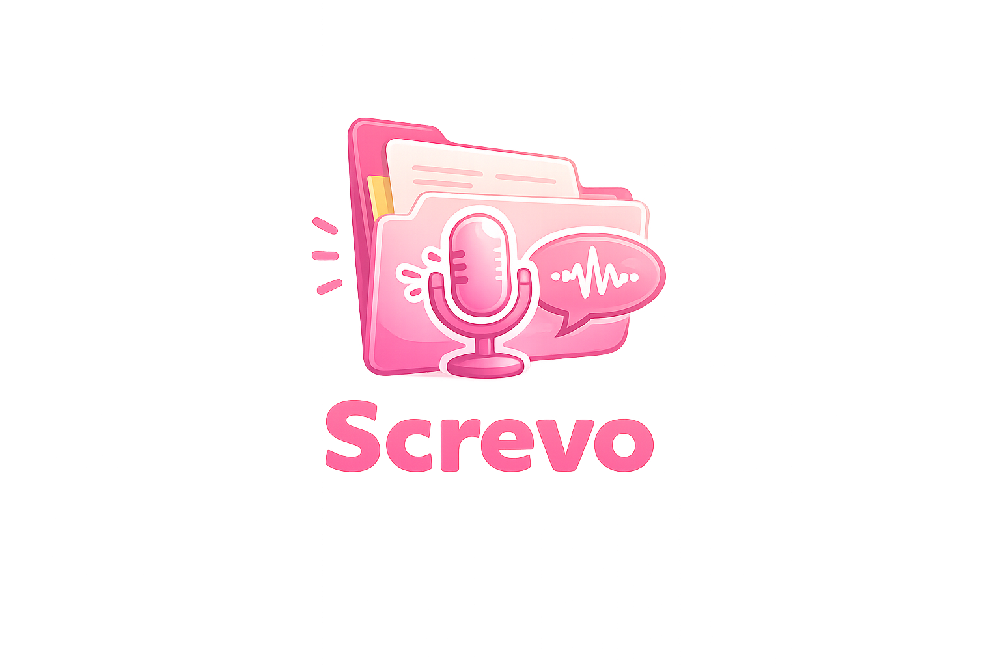

<p align="center">
  
</p>

<h1 align="center">Screvo</h1>

<p align="center"><b>Grava a tela · transcreve o áudio · lê o texto da tela · resume com IA</b></p>

---

**Screvo** é um gravador de tela leve para Windows que vai muito além de gravar:
transcreve o áudio de forma **offline**, lê o texto que aparece na tela (OCR) e
usa IA para **resumir**, **conversar sobre o vídeo** e montar um
**relatório completo com capturas**. O nome vem de *tela* + *escrevo*.

Interface em PyQt6 com tema rosa, janela de cantos arredondados, atalho global,
overlay flutuante e ícone na bandeja.

---

## ✨ Recursos

### Gravação
- 🎥 Gravação de tela via FFmpeg — tela cheia, monitor específico, **janela** ou **região selecionada**.
- ⌨️ Atalho global configurável (padrão `Ctrl+Shift+R`) + overlay flutuante.
- 📌 **Marcadores** durante a gravação (botão no overlay) → salvos em `*.markers.txt`.
- 🔊 Áudio do sistema + microfone (WASAPI loopback), volume e mudo.
- ⚙️ Formatos `mp4/mkv/avi/webm`, FPS, qualidade e codec (`h264`/`h265`).

### Transcrição e texto
- 🗣️ **Transcrição local (offline)** com NVIDIA **Parakeet TDT v3** (via `sherpa-onnx`).
- ⏱️ **Timestamps clicáveis** — no player, clique num trecho para pular ao momento.
- 👥 **Identificação de falantes** (diarização) — opcional (best-effort).
- 🖥️ **OCR da tela** — extrai o texto exibido no vídeo (slides, código, erros) para `*_tela.txt`.
- 🎵 **Player de áudio embutido** em cada vídeo (ouve o áudio direto na lista).

### IA
- 🤖 Provedor à escolha: **Gemini, Claude, OpenAI, DeepSeek** ou **IA local**.
- 🖥️ **IA local no app (Gemma)** — roda 100% dentro do Screvo (via `llama.cpp`),
  **sem programas externos e sem custo de API**. O app detecta seu hardware,
  sugere o modelo Gemma conforme a RAM e baixa o modelo (GGUF) com progresso.
- 📝 **Resumo** em Markdown com **templates** (geral, ata, tutorial, doc técnica, tarefas, changelog).
- 💬 **Chat sobre o vídeo** — perguntas e respostas usando a transcrição como contexto.
- ⭐ **Relatório Completo** — encadeia legenda → OCR → IA e gera um relatório em
  Markdown onde a IA **insere capturas do próprio vídeo** no corpo do texto.
- ⤓ Exportação de resumos/relatórios em **.md / .docx / .pdf** (com imagens).

### Organização
- 🎬 Gerenciador de vídeos: assistir, renomear, mover, excluir, criar pastas/grupos.
- 👀 Visualizador integrado (Markdown formatado) com **Copiar** e **Exportar**.

---

## 📦 Requisitos

- Windows 10/11 (x64)
- Python 3.10+ (para rodar a partir do código)
- FFmpeg (`ffmpeg.exe` e `ffprobe.exe`) — veja abaixo

```bash
pip install -r requirements.txt
```

Algumas funções instalam suas dependências sozinhas na 1ª vez (rodando do
código-fonte): `sherpa-onnx` (transcrição), `winocr` (OCR), `python-docx` e
`reportlab` (exportar docx/pdf) e `llama-cpp-python` (IA local no app).

### FFmpeg

Os binários do FFmpeg **não** ficam no repositório (cada um passa de 100 MB, o
limite do GitHub). Baixe uma build em
[gyan.dev/ffmpeg/builds](https://www.gyan.dev/ffmpeg/builds/) e copie
`ffmpeg.exe` e `ffprobe.exe` para `ffmpeg/bin/` (veja `ffmpeg/bin/LEIA-ME.txt`).

---

## ▶️ Executando

```bash
python main.py
```

O app inicia na bandeja. Use o atalho (padrão `Ctrl+Shift+R`) para abrir o
seletor de gravação, ou dê dois cliques no ícone da bandeja para as configurações.

---

## 🏗️ Build

```bat
build.bat            :: gera dist/Screvo.exe (PyInstaller)
build_installer.bat  :: gera o instalador (requer Inno Setup)
```

> A exportação **.docx/.pdf** já vai empacotada no `.exe`. O **OCR** (`winocr`)
> e a **IA local** (`llama-cpp-python`) ficam de fora do executável (o `winrt`
> não empacota bem e o motor de IA é grande) — essas duas funcionam rodando a
> partir do código-fonte.

---

## 🤖 Configurando a IA

Aba **IA** → escolha o **provedor**, (opcional) o **modelo**, cole a **API key**
e o **template de resumo**. A chave fica salva só no seu computador
(`%APPDATA%\VideoRecorder\config.json`).

| Provedor  | Modelo padrão                 |
|-----------|-------------------------------|
| OpenAI    | `gpt-4o-mini`                 |
| Claude    | `claude-3-5-sonnet-20241022`  |
| Gemini    | `gemini-1.5-flash`            |
| DeepSeek  | `deepseek-chat`               |

### IA local no app (Gemma)

Não precisa de nenhum programa externo. Na aba **IA**, seção *IA LOCAL NO APP*,
o app mostra seu hardware (GPU/RAM) e sugere o modelo **Gemma** adequado à sua
RAM (o mais leve funciona em quase tudo). Clique em **Baixar / Usar modelo** — o
modelo (GGUF) é baixado uma vez, carregado dentro do Screvo (via `llama-cpp-python`,
instalado automaticamente na 1ª vez) e a IA passa a rodar **100% local, por CPU,
sem API key nem custo**. Modelos maiores são mais lentos na CPU.

---

## 🔒 Privacidade

- Gravação, transcrição e OCR rodam **100% na sua máquina**.
- Só as funções de IA (resumo, chat, relatório) enviam texto ao provedor que
  **você** escolher, com a **sua** API key.

---

## 📄 Licença

Distribuído sob a licença **MIT** — veja [`LICENSE`](LICENSE).
O FFmpeg mantém sua própria licença LGPL/GPL.
